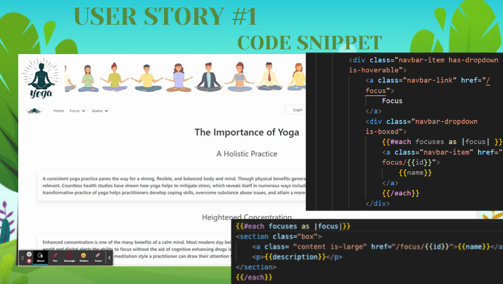
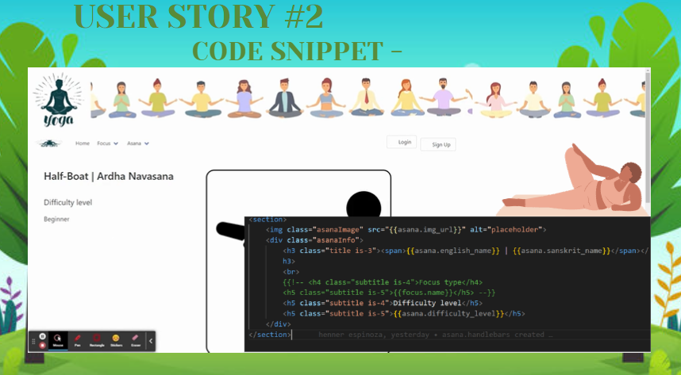
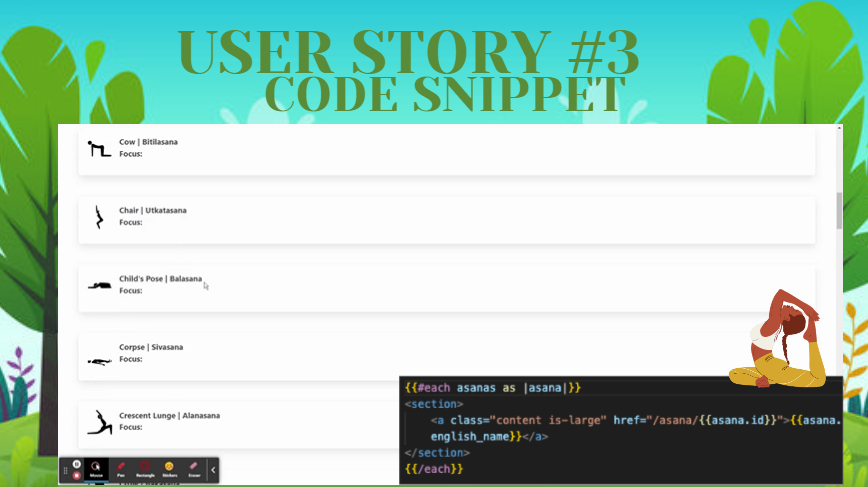
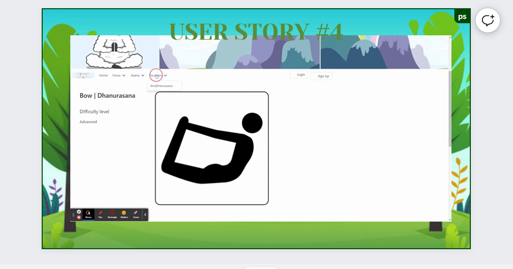

# yoga-Rx
## Description 
[Visit the Deployed Site](http://yoga-rx.herokuapp.com/)
YOGA-Rx(poses for your pain points) is a full stack web application.
Where a user can register, browse in a asanas database(API key).user select asanas and add them to a favorites and keep recorded it in history, and request authentication to have access to the favorites.

## Getting Started

Create a Full Stack Web Application with the following features:

- [x] Use a Node web server
- [x] Backed by a MySQL database with a Sequelize ORM
- [x] Use an existing public dataset to power the database (YogiAPI)
- [x] Migration strategy using seeds and schema files
- [x] Routes for retrieving and adding new data
- [x] Incorporate authentication (Passport, BCrypt)
- [x] Folder structure that meets the MVC paradigm
- [x] Use Handlebars for server-side templating
- [x] Protected API keys in Node with environment variables
- [x] Polished front end/UI
- [x] Meet good-quality coding standards (indentation, scoping, naming, etc.)
- [x] Deployed using Heroku (with data)

**User stories**

### 1. As a yogi I want a drop-down SEARCH FEATURE that displays focus areas of the body so that I can click on an area and view relevant asanas;

 

### 2. As a yogi I want a drop-down search feature that displays asanas so that I can view a list of all asanas;

### 3. As a yogi I want to click an asana from the asana list so that I can view specific details of an asana on a click;

### 4. As a yogi I want to save my favorite asanas so that after logging in I can easily access favorites before a practice;

## Installation and Usage

The project was uploaded to [GitHub](https://github.com/) at the following repository:
[https://github.com/justhenner/yoga-RX](https://github.com/justhenner/yoga-RX)

You can access the deployed application with the Heroku link:
http://yoga-rx.herokuapp.com

## Contribution

To install the project follow these steps:

1. Clone the application from GitHub with:

   - git clone [clone link from GitHub]

2. From the root folder, install the dependencies with:

   - npm install

3. Run the app with:
   - node server.js

## Technology Used 

| Technology Used         | Resource URL           | 
| ------------- |:-------------:| 
| HTML    | [https://developer.mozilla.org/en-US/docs/Web/HTML](https://developer.mozilla.org/en-US/docs/Web/HTML) | 
| CSS     | [https://developer.mozilla.org/en-US/docs/Web/CSS](https://developer.mozilla.org/en-US/docs/Web/CSS)      |   
| Javascript | [[https://git-scm.com](https://developer.mozilla.org/en-US/docs/Web/JavaScript)/][(https://git-scm.com/](https://developer.mozilla.org/en-US/docs/Web/JavaScript))     || ------------- |:-------------:| 
| Bulma    | [https://bulma.io/](https://bulma.io/) | 
| [Handlebars Templating     | [https://handlebarsjs.com/](https://handlebarsjs.com/)      |   
| Sequelze | [[https://git-scm.com/](https://sequelize.org/)](https://sequelize.org/) | Passport JS & bcrypt.js   | [https://www.passportjs.org/](https://www.passportjs.org/) | 
| Heroku     | [https://id.heroku.com](https://id.heroku.com)      |   
| Node | [[https://nodejs.org](https://nodejs.org)/]

## Authors

** OUR TEAM ** 

- [Henner Espinoza](https://github.com/justhenner)
- [Joshua Matsumoto](https://github.com/joshmatsumoto)
- [Roksolana Odynak](https://github.com/poucoLouco)
- [Peter Shaughnessy](https://github.com/prnessy23)

## License

